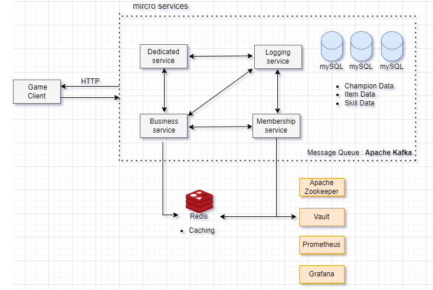

# resistance

> 20세기 말. 한국 근대사를 재조명해 역사의식을 키우기 위해 텀블벅 후원 준비중인 기능성 게임

사용자 데이터 활용,공지사항 및 텀블벅 후원 상품 제공 등을 위해 웹서버를 구현했습니다.

이후 Flask로 구축했던 모놀리식 구조에서 확장성의 한계를 느껴 **MSA Hexagonal 구조로 마이그레이션**을 시도했습니다.

각 모듈별 통신은 비동기적으로 이루어지도록 하기 위해서 Kafka를 이용해서 구현했습니다.

기술스택 :  
Spring MVC, Spring data JPA, Kafka, Redis(Lettuce), Vault, MySQL

 
 

다음과 같이 하위 도메인별로 모듈을 분해했습니다.

- Membership-service : 사용자의 로그인, 회원가입을 담당하는 모듈
- Business-service : 사용자의 데이터로 동료, 친구 시스템이나 저장, 불러오기를 담당하는 모듈
- Dedicated-service : 관리자의 공지사항이나 환율을 공지하기 위한 모듈
- Logging-service : IPC 통신간의 Tracing을 위한 로그 기록 모듈
 
 

 
 

📌 MSA 환경에서 트랜잭션의 Rollback은 복잡하고 리스크가 큰 작업이라 **유연한 대응**이라는 목적에 주객전도 된다고 생각했습니다.

가능하면 정석적인 트랜잭션의 구현을 최대한 피하거나, 기교로 해결하는게 좋다고 생각해 설계 과정에 많은 고민을 했습니다.

서비스간의 연계가 이뤄지는 대부분의 기능을 **온전히 조회를 목적으로 하도록 하위 도메인별로 설계했기에**, 따로 트랜잭션의 Rollback에 대한 고려를 하지 않았습니다.

Kafka IPC의 오류나 특정 서비스의 장애 상황 등 으로 해당 기능 (Business-service의 친구 목록, 동료 목록 조회)이 작동하지 않아도 서비스에 지장가지 않도록 구성했습니다.

 
 

### 주요 기능

- 로그인과 회원가입
    - Vault Framework를 사용해 사용자의 민감한 정보를 암호화합니다.

- 재화 시스템과 시스템 공지사항  
  - 게임중 얻는 아이템 중에서 재화 시스템을 도입해 서버 내 재화간의 환율에 따라 교환합니다.  
    ex) 청에서 유입된 마재은이나 달러, 파운드화 등

- 친구 기능
    1. 스테이지 참가 이전에 **함께 데려갈 동료 리스트**를 랜덤으로 서버에서 추출
    2. 스테이지 종료 이후 친구 추가 여부를 묻고, 친구 추가를 하면 **친구신청대기** 상태
    3. 상대방이 수락하면 상호간 친구로 등록되어서 **함께 데려갈 동료 리스트**에 우선적으로 표
    4. 친구 삭제 버튼을 통해 삭제

- 관리자 페이지

    1. 사용자들의 능력치와 코스튬 정보, 친구목록 등 데이터를 조회
    2. 텀블벅 후원 상품인 부위별 코스튬을 지급하기 위한 hashcode를 생성 및 사용여부 열람
    3. 게임안에서 사용되는 재화의 날짜별 환율 비율을 서버에서 통제
    4. 간단한 공지사항이나 이벤트 상황을 실시간으로 사용자들에게 전달 (Polling 방식)