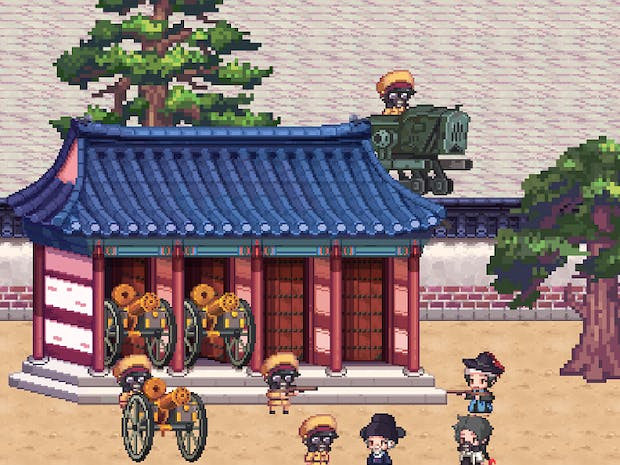

# resistance backend

개발중인 모바일 게임 resistance의 백엔드 서버.

    
MSA Hexagonal architecture, Kafka로 microservice간의 Async IPC 통신

기술스택 :  
Spring MVC, Spring data JPA, Kafka, Redis , Vault

예상되는 하위 도메인 분리 계획

      - Membership 시스템

            → Vault와 로그인과 회원가입

      - Logging 시스템

      - Game Business 시스템

            → 게임 데이터 불러오기 및 친구 기능 열람 등

            → 계정 서버와 IPC 통신 필요

      - Dedicated 시스템

            → 환율 제어, 공지사항 게시글 작성과 수정, 목록 등의 CRUD